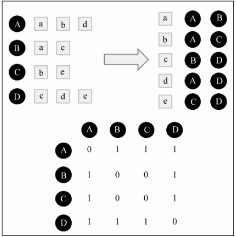
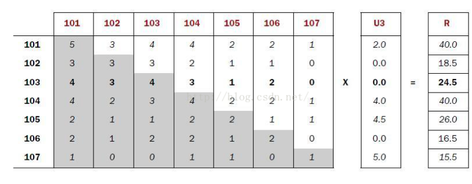
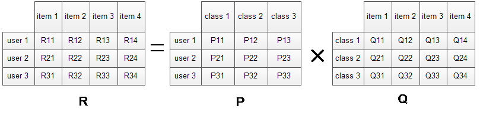
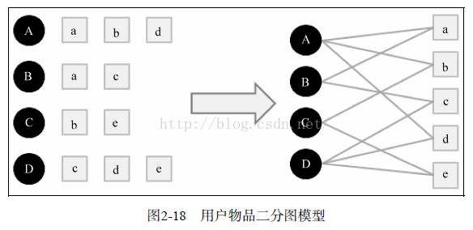
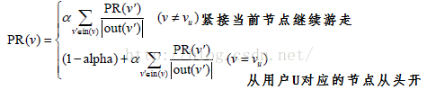
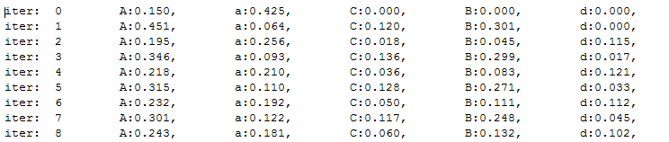

# 五分钟推荐系统-协同过滤

### 1、基本概念

协同过滤 = Collaborative Filte， 依据用户行为或物品的相似性，提供推荐。

系统过滤可以仅仅依据用户行为，不用考虑任何物品属性和用户属性的描述信息，进行推荐。

**行为提取**： 1- 从日志中挖掘会话日志-> 记录查询+返回结果+点击。 

​                    2- 评分，投票，书签，转发， 点击流，页面停留，购买

**行为存储**：    hadoop Hive  , Google dremel , hadoop drill  

**一般步骤：**

1、收集用户偏好；

2、降维：对数据量大的维度，采用SVD 或PCA 主分量分析进行降维 

3、找到相似的用户或物品：建立物品或用户的特征向量；

4、圈定邻居： 可以通过k近邻法或者邻居法来求出相应特征点的邻居‘

5、计算推荐（基于用户，基于物品）

```
**基于用户**：找出与该用户相似口味的一些用户出来， 看看那些用户买过一些什么东西，然后看看他买过的但是该用户没有买过，就把这些东西推荐给该用户 
**基于商品**：当用户面对一个商品的时候，我们会把与该商品相似的商品推荐给该用户
```

### 2、 基于用户UserCF

-推荐兴趣类似的其他用户喜欢的物品。

#### 2.1用户兴趣相似度矩阵计算

根据两个用户u,v 喜欢的物品集合 N(u),N(v)，通过相似度算法得到两个用户的相似度矩阵。

1- jaccard :   (N(u) && N(v))/(N(u) || N(v))    
2- 余弦相似度   len(N(u)&& N(v))  / (len(N(u))x len(N(v)))

用户相似度计算：

```python
def UserSimiliar(train):
     item_users  = {}  
     for u,items in train:
           for item in items.keys():
                 if item is not in item_users.keys():
                    item_users[item]=set()
                 item_users[item].add[user]    # 1. 物品-用户倒排
    C =N= {}
    for i,users in item_users:             
                for u in users : 
                       N[u]+=1                   
                       for v in users: 
                             if u!=v:
                                 c[u][v]+=1     # 2. 累加用户和用户的共同喜欢的物品数目
    W=dict()
     for u,related_users in C:
         for v,cuv in related_usres.items():
                   W[u][v] = cuv/math.sqrt(N[u]*N[v])    # 3. 计算用户和用户的相似度矩阵 
    return W
```


​                                                             倒排表和用户相似度矩阵


#### 2.2 计算推荐

根据上面得到的相似度矩阵，取出他兴趣类似的K 个用户喜欢的任意物品,推荐给用户。

```python
def Recommend(u,train,W):
    rank ={}
    interacted_items = train[u]  # 用户喜欢的物品
    for v, wuv in sorted(W[u].items,key=itemgetter(1)),reverse= True)[0:k]:#用户相似TopN 
           for i,rvi in train[v].items:   # 相似用户喜欢的物品    
               if i not in interactive_items:  #不是用户U 喜欢的，就推荐
                   rank[i]+=wuv*rvi 
  return rank .  
```
#### 2.3 优化：去热门 

如果两个用户都买过新华字典，这丝毫不能说明他们兴趣相似，因为绝大多数人都要买。所以需要惩罚热门的相似物品。所以对于热门的相似物品降权，更新用户相似度。

```
 C[u][v]+= 1/math.log(1+len(users))  # 喜欢的用户越多，那么降权  
```

#### 2.4 缺点

1、计算资源指数随用户数指数增长
2、很难解释推荐结果

#### 2.5 应用场景

**UserCF适合新闻网站**，新闻网站的个性化比较粗粒度，例如国际新闻，体育新闻 ，而且新闻更新快，**物品的更新速度远远快于新用户的加入速度。** 

或者其他适用于**用户不太多**，容易计算用户相似度矩阵的场景。

### 3、基于物品ItemCF

-推荐看过的物品类似的物品。

A 和B 相似，是由于喜欢A 的用户大都也喜欢B。例如：购买itemA 的同时，购买itemB。

也叫同现相似度。


**基于ItemCF的原理和基于UserCF类似，只是在计算邻居时采用物品本身，而不是从用户的角度。** 

#### 3.1 物品相似度计算
Wij = |同时喜欢物品i,j 的人数| /  |喜欢物品i的人数|

惩罚热门物品：
Wij = |同时喜欢物品i,j 的人数| / sqrt(喜欢i 的人数x 喜欢j的人数）

```python
def ItemSimilarity(train):
    c=N={}
   for u,items in train.items():          1、建立物品关联表，累加用户共同喜欢数
        for i in items :
             N[i] +=1 
             for j in items;
                 c[i,j]+=1    
   S = {}
   for i , related_items in C.items
        for j,cij in related_items.items():
               Sij = cij /match.sqrt(N[i]*N[j])   2、计算物品相似度，建立物品相似度矩阵     
return S 
```

#### 3.2 推荐

计算用户u对一个物品的兴趣：，Puj = sum(Sji, Rui)   和j 最类似的k个物品集合 
该公式的含义是：和用户历史上感兴趣的物品越相似的物品，越可能在用户的推荐列表中获得高排名。

```
def Recommendation(train , user_id, S,K) : 
    rank = {}
    ru = train[user_id]  
    for rui , pi in ru.items():  # pi 可以简单的命名为1   # 对于用户喜欢的物品
         for j,sj in sorted (S[rui].items, key= itemgetter(1),reverse=True)[0:k]      
                               #最相似的K个物品 根据相似矩阵的物品，找出最相似的物品
             rank[j].weight +=pi*sj    # 找到1次加一次 
             rank[j].reason[i]=pi*wj   
  return rank
```
itemCF 流行度效果更好些，但是准确率随k值提高没有改善。

#### 3.3 优化

剔除用户活跃度对物品相似度的影响 
1、IUF  
Sij = cij /match.sqrt(N[i]*N[j])   计算物品相似度     
弱化，那么仅仅忽略 Cij  = (1+1/log(1+N(u))   
或者   用 加大坟墓为 len(Ni)(1-a)len(Nj)a次方  a 为0-1间数 

2、忽略掉活跃度过高的用户。  

#### 3.4 应用场景

**itemcf适合电商，电影网站**。电商网站中用户的兴趣是比较固定和持久的。 
同样也适合于用户太多，**很难计算用户相似度矩阵的场景** 


#### 3.5 设计因素：

在真实的环境中设计推荐的时候，要全面考量数据量，算法性能，结果准确度等的指标。
推荐算法选型：基于物品的协同过滤算法ItemCF，并行实现
数据量：是否需要基于大数据架构，支持GB,TB,PB级数据量
算法检验：可以通过准确率，召回率，覆盖率，流行度等指标评判。
结果解读：通过ItemCF的定义，合理给出结果解释

#### 3.6 案例

测试数据集:small.csv
每行3个字段，依次是用户ID,电影ID,用户对电影的评分(0-5分，每0.5分为一个评分点！) 

1,101,5.0 
1,102,4.0 
2,101,3.0 
...

步骤：

1. 建立物品的同现矩阵, 按用户分组，找到每个用户所选的物品，单独出现计数及两两一组计数 

1. ​     [101] [102] [103] [104] [105] [106] [107]
2. [101]  5    3    4    4    2    2    1
3. [102]  3    3    3    2    1    1    0
4. [103]  4    3    4    3    1    2    0
5. [104]  4    2    3    4    2    2    1
6. [105]  2    1    1    2    2    1    1
7. [106]  2    1    2    2    1    2    0
8. [107]  1    0    0    1    1    0    1 

2. 建立用户对物品的评分矩阵, 按用户分组，找到每个用户所选的物品及评分 

   1. ​     U3
   2. [101] 2.0
   3. [102] 0.0
   4. [103] 0.0
   5. [104] 4.0
   6. [105] 4.5
   7. [106] 0.0
   8. [107] 5.0

   

   

3. 矩阵计算推荐结果，取最高值



### 4、隐语义模型LFM   latent factor model  

LFM 模型解决推荐分类喜欢的物品

#### 4.1 基本流程

1、根据用户的行为实现物品的自动聚类，给物品分类。2个物品被很多用户同时喜欢，那么他们属于一个隐类的概率很大。
2、确定用户感兴趣哪些类, 通过用户的行为统计得到。
3、对一个类，推荐哪些物品给用户，确定物品的权重，权重可以这样定义：在一个隐类中，如果一个物品被很多用户喜欢，那么它必定权重较大。

#### 4.2 建模结果

对于一个给定的用户行为数据集（数据集包含的是所有的user, 所有的item，以及每个user有过行为的item列表），使用LFM对其建模后，我们可以得到如下图所示的模型：（假设数据集中有3个user, 4个item, LFM建模的分类数为4）



R矩阵是user-item兴趣度矩阵，矩阵值Rij表示的是user i 对item j的兴趣度；P是user-class兴趣度矩阵，Pij表示user i对class j的兴趣度；Q是item-class权重矩阵，Qij表示class i中item j的权重。

Interest(u,i) = Pu x Qi = Sum(Puk,Qik)    

#### 4.3 模型实现

1、训练集准备

首先必须要有一个训练样本集，针对每个用户，选择用户的行为数据集作为正样本，正样本中都是用户发生过行为（喜欢）的物品,Rui为1，负样本是热门但是用户没有行为的样本,Rui值为0。

```
def randomSelectNegativeSample(items):    
    for i in range(0,len(items)*3) : 
            item = items_pool[randint(0,len(items_pool)-1] 
            ret[item]=0
            n=n+1 
            if n> len(items):
                  break
return ret 
  items_pool 维护了候选的热门物品列表；物品i出现次数和i的流行度成反比。这样采样出的就是不是那么流行的概率大
  items 用户喜欢的物品
```

2、建模与训练

模型：Interest(u,i) = Pu x Qi = Sum(Puk,Qik)  

损失：LFM的损失函数仍然是平方差+正则项。

训练：

​    一次迭代的步骤：
​          训练时，一个用户一个用户的依次迭代：
​              先从训练样本集中取用户u1的数据：
​              从该数据集中依次选取一个，更新的值。N个item，要更新N次，要更新1次。
​          再依次用其他用户u2，u3，…数据不断更新参数。 
​    一次迭代完成后，得到一个P、Q，并得到损失函数C的一个值。
​    不断的多次迭代，直至损失函数C的值收敛（或者，循环结束条件设为一个迭代次数N，迭代N次后结束）。

伪代码如下： 

```
def LFM(user_items,F隐类别数 ,max_iter,alpha 学习速率,lambda 正则化参数):  
 
     [P,Q] = InitModel(user_items,F)  # 随机建立一个2个P, Q 矩阵 
     for step in range(0,max_iter): 
              for user,items in user_items.items():  
                     samples = RandSelectNegativeSamples(items)  #选择负样本 
                     for item , rui in samples.items():   # 物品，用户喜欢物品度
                              eui = rui - Predict(user,item)  # 差异 loss 
                              for f in range(0,F):     # 优化参数
                                    P[user][f]  +=  alpha *(eui*Q[item][f] - lambda *p[user][f])   
                                    Q[user][f]  +=  alpha *(eui*P[user][f] - lambda *Q[item][f]) 
             alpha *= 0.9  学习率递减      
return P,Q   
```

#### 4.4 取得推荐

```
def Recommand(user , P,Q) :
      rank = {}
      for f , puf in P[user].items():  #类别 ， 概率
                  for i, qfi in Q[f].items():  #物品，概率
                       rank[i]  += quf*qfi   
      return rank; 
```

#### 4.5 效果分析

​      正负样本的比例ratio 对LFM 性能影响最大


### 5、基于图的推荐模型

#### 5.1基本概念

**二分图**表示用户物品间关系，并利用**图算法**进行个性化推荐 

 

G(V,E) 表示用户物品关系，

​    V是用户或者物品。 V=Vu+Vi
​    E 就是用户和物品的关联


**图推荐算法** 推荐就是找到没有边直连的物品节点。

​               1、最短路径，连接两个顶点之间的路径长度都较短
​               2、相同长度路径，那么选择点出度更小的
​                     例如（A,b,C,e）和（A,d,D,e）, 如果C 出度为2，D出度为3， 那么优选 （A,b,C,e）. 


####  5.2 基于随机游走的PersonalRank算法

##### 思路：

Vu开始 游走到任何一个节点时，首先按照概率α决定是继续游走，还是停止这次游走并从Vu节点开始重新游走。如果决定继续游走，那么就从当前节点指向的节点中按照均匀分布随机选择一个节点作为游走下次经过的节点。 

用公式表示为：



##### 代码：

1、设置PR(u) 设置为1 , 例如PR(A) =1  

2、对所有节点进行，根据父节点的出度进行rank分配计算，相当于分配一次rank .    

​      rank[j] += alpha * rank[i] / (1.0 * len(ri))      

​      rank[root] = rank[root]+(1 - alpha)  

3、循环一定次数，到概率变动较小

这样得到：用户A 对所有其他节点的rank

4、然后取其中的rank值较大的物品  

​	

```python
#-*-coding:utf-8-*-
'''
Created on 2016年6月16日
@author: Gamer Think
'''
 
'''
G：二分图   alpha:随机游走的概率   root：游走的初始节点     max_step；最大走动步数
'''
def PersonalRank(G, alpha, root, max_step):
    rank = dict()  
    rank = {x:0 for x in G.keys()}
    rank[root] = 1  
    #开始迭代  
    for k in range(max_step):  
        tmp = {x:0 for x in G.keys()}  
        #取节点i和它的出边尾节点集合ri  
        for i, ri in G.items():  #i是顶点。ri是与其相连的顶点极其边的权重
            #取节点i的出边的尾节点j以及边E(i,j)的权重wij, 边的权重都为1，在这不起实际作用  
            for j, wij in ri.items():   #j是i的连接顶点，wij是权重
                #i是j的其中一条入边的首节点，因此需要遍历图找到j的入边的首节点，  
                #这个遍历过程就是此处的2层for循环，一次遍历就是一次游走  
                tmp[j] += alpha * rank[i] / (1.0 * len(ri))  
        #我们每次游走都是从root节点出发，因此root节点的权重需要加上(1 - alpha)  
        #在《推荐系统实践》上，作者把这一句放在for j, wij in ri.items()这个循环下，我认为是有问题。  
        tmp[root] += (1 - alpha)  
        rank = tmp  
  
        #输出每次迭代后各个节点的权重  
        print 'iter:  ' + str(k) + "\t",  
        for key, value in rank.items():  
            print "%s:%.3f, \t"%(key, value),  
        print  
  
    return rank  
  
 
'''
主函数，G表示二分图，‘A’表示节点，后边对应的字典的key是连接的顶点，value表示边的权重
'''
if __name__ == '__main__':
    G = {'A' : {'a' : 1, 'c' : 1},  
         'B' : {'a' : 1, 'b' : 1, 'c':1, 'd':1},  
         'C' : {'c' : 1, 'd' : 1},  
         'a' : {'A' : 1, 'B' : 1},  
         'b' : {'B' : 1},  
         'c' : {'A' : 1, 'B' : 1, 'C':1},  
         'd' : {'B' : 1, 'C' : 1}}  
  
    PersonalRank(G, 0.85, 'A', 100) 
```

#####  结果：




结果：

iter:  9	A:0.292, 	B:0.230, 	C:0.109, 	a:0.131, 	b:0.028, 	c:0.156, 	d:0.053, 	

iter:  99	A:0.269, 	B:0.185, 	C:0.086, 	a:0.154, 	b:0.039, 	c:0.190, 	d:0.076, 

iter:  999	A:0.269, 	B:0.185, 	C:0.086, 	a:0.154, 	b:0.039, 	c:0.190, 	d:0.076, 

能够看到最后收敛：

与A相关度最高的依次是 A（0.269），c（0.190），B（0.185），a（0.154），C（0.086），d（0.076），b（0.039），去除A已经连接的a,c，剩下的推荐依次为B,a,C,d,b。