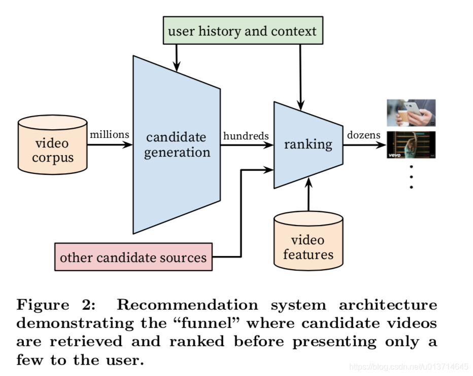
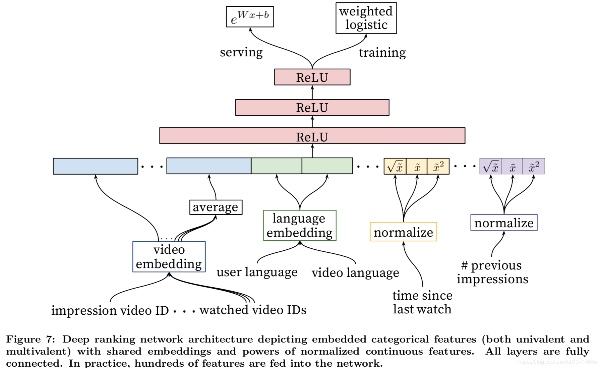
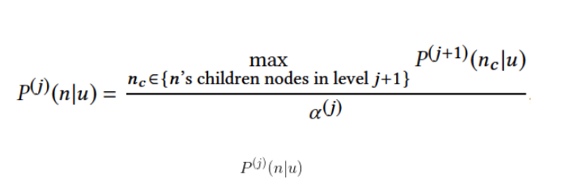
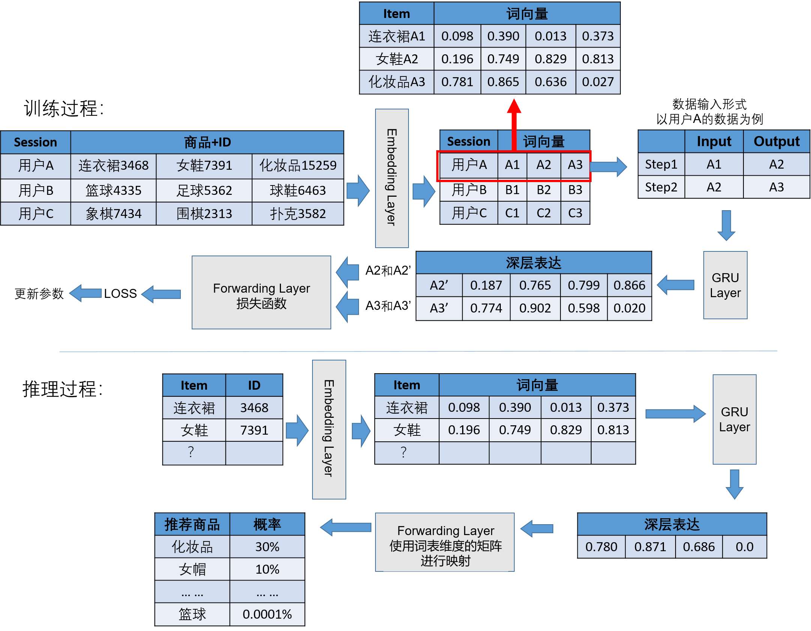

# 5分钟推荐系统-深度学习召回

### 1、概述

目前的深度学习召回模型有几大类型：DNN、双塔语义召回、RNN序列召回和深度树匹配召回等。

（1）DNN：以经典的Youtube DNN为代表，相比于传统的协同过滤方法，DNN是使用统一的（用户、物品）向量空间来代替原来的两个独立的向量空间，使用深度网络将用户、物品映射到这个统一的低维向量空间来发现学习更高阶的用户物品相似性。

（2）双塔语义召回：以微软2013年的DSSM（Deep Structured Semantic Models）模型为代表，该模型是将不同对象映射到统一的语义空间中，利用该空间中对象的距离计算相似度。因为会为用户和商品分别建立一路模型，最后计算相似度，因此该类模型又称为“双塔”模型。

（3）深度树匹配召回：以阿里巴巴的TDM（Tree-based Deep Match）模型为例，该模型直接利高级深度学习模型在全库范围内检索用户兴趣。其基本原理是使用树结构对全库item进行索引，然后训练深度模型以支持树上的逐层检索。该模型试图通过结合树结构搜索与深度学习模型来解决召回的高性能需求与使用复杂模型进行全局搜索与之间的平衡。它将召回问题转化为层级化分类问题，借助树的层级检索可以将时间复杂度降到对数级。

（4）RNN序列召回：基于用户session中的点击序列进行建模召回有很多种方式，其中使用RNN深度网络结构来刻画是其中比较有代表性的一种。例如：GRU4REC

### 2、Youtube DNN  

#### 2.1 Youtube 推荐难点

1、体量大：包括用户和视频集都十分巨大，如何从上百亿的视频中为上亿用户推荐他们所感兴趣的视频？

2、新鲜度：youtube视频集是一个动态的视频库，每秒上传的视频多达几个小时，如何平衡好新视频（new content）和以北大家所接受的热门视频（well-established videos）之间的关系？

3、噪音：youtube用户的行为很难准确预测（由于稀疏性和外部因素的不可控性）

#### 2.2 推荐系统结构



Candicate generation从上百亿的视频中选出一个百级数量的候选视频集

Ranking 将这百级数量的视频排序，选出topK个用户感兴趣的视频推荐给用户。

#### 2.3 候选集生成Candicate generation

推荐问题看作一个多分类问题（超大规模多分类）：已知视频全集V，用户U和其上下文C，预测其在t时刻的视频类别。

##### 模型结构


将用户历史观看视频ID （定长的，如历史前20次观看记录，不足补零）和用户历史搜索视频ID转化成定长的的embedding vector（可以通过求均值，补零等操作转化成定长）。

##### 新颖性： 

**构建了一个特征age of training example,简单的可以理解为是视频的年龄**，初始值设为0，随着时间的增长，记录视频的年龄。


所以文中使用的是（b）方法采样和构建标签。


#### 2.4  Ranking  排序，topK推荐生成



1、 特征工程：

在构建特征的过程中，作者发现一个重要的特征信号是该用户历史上与该视频或者同类视频的交互历史（pv，click等），由此启发构建特征：该用户在该频道下看过多少视频，在该频道下上一次观看视频的时间，

2、embedding类别特征：

和candidate generation类似，对每个视频ID embedding，

3、归一化连续特征：

众所周知，NN对输入特征的尺度和分布都是非常敏感的，实际上基本上除了Tree-Based的模型（比如GBDT/RF），机器学习的大多算法都如此。我们发现归一化方法对收敛很关键，推荐一种排序分位归一到[0,1]区间的方法，累计分位点：

4、建模期望观看时长

5、不同隐层的实验

下图的table1是离线利用hold-out一天数据在不同NN网络结构下的结果。如果用户对模型预估高分的反而没有观看，我们认为是预测错误的观看时长。weighted, per-user loss就是预测错误观看时长占总观看时长的比例。


https://blog.csdn.net/u013714645/article/details/97899342

2.5 源码 google colab

https://colab.research.google.com/github/shenweichen/DeepMatch/blob/master/examples/colab_MovieLen1M_YoutubeDNN.ipynb

### 3、DSSM 

 DSSM模型分别使用相对独立的两个复杂网络构建用户相关特征的user embedding和item相关特征的item embedding，所以称为双塔模型。

#### 3.1 模型结构

双塔模型最大的特点是user和item是独立的两个子网络，对工业界十分友好。将两个塔各自缓存，线上预测的时候只需要在内存中进行相似度运算即可。


例如：


#### 3.2 应用场景

百度广告推荐
用户特征，广告特征 分别训练
线上预测时使用LR、浅层NN等轻量级模型或者更方便的相似距离计算方式。
 谷歌youtube
对于用户侧的塔根据用户观看视频特征构建user embedding，对于视频侧的塔根据视频特征构建video emebdding。
userembeding 视频id, channel id, pastviewed ,
videoembeding 视频id, channel id,views, likes

#### 3.3 示例-广告推荐

##### 数据说明

1、user embedding: 用户侧输入用户对广告的历史行为特征(包括点击、下载、付费等)
2、ad embedding广告侧输入广告特征得到相同长度的
3、线上infer时给定一个广告ad，然后分别和全量用户求相似度 , 找到“距离最近”的user子集，对这部分人群投放广告从而完成广告推荐任务。

##### 输入层

模型训练分成两座不同的“塔”分别进行，其实也就是两个不同的神经网络。其中一座塔是用于生成user embedding。输入用户特征训练数据，用户特征包括用户稠密特征和用户稀疏特征，其中用户稠密特征进行one-hot编码操作，用户稀疏特征进行embedding降维到低维空间(64或者32维)，然后进行特征拼接操作。广告侧和用户侧类似。

##### 表示层

得到拼接好的特征之后会提供给各自的深度学习网络模型。用户特征和广告特征经过各自的两个全连接层后转化成了固定长度的向量，这里得到了维度相同的user embedding和ad embedding。各塔内部的网络层数和维度可以不同，但是输出的维度必须是一样的，这样才能在匹配层进行运算。项目中user embedding和ad embedding 维度都是32。

##### 推荐

模型训练好了之后会分别得到user embedding和ad embedding，将它们存储到redis这一类内存数据库中。如果要为某个特定的广告推荐人群，则将该广告的ad embedding分别和所有人群的user embedding计算cos相似度。选择距离最近的N个人群子集作为广告投放人群，这样就完成了广告推荐任务。

### 4、深度匹配树 TDM*

#### 4.1 基本原理

使用树结构对全库item进行索引，然后训练深度模型以支持树上的逐层检索。

#### 4.2 算法流程

1、初始化树模型      希望将相似的物品放到树中相近的地方
     a. 假设一共有k个类别，我们将这k个类别随机排序，排序后为C_1、C_2、...... 、C_k，每一类中的物品随机排序，如果一个物品属于多个类别，随机分一个，确保每个商品分配的唯一性。
     b. 分为2类 
     c. kmeans对商品递归分为2类,直到叶子节点1个商品

2、学习兴趣树叶子节点的嵌入表示


非叶子节点表示：用户u对商品n感兴趣的概率， 第j层所有节点概率加起来=1
alphaj 是层j的归一化项，上式的意思是某个非叶子节点的兴趣概率等于它的子节点中兴趣概率的最大值除以归一化项。

**正负样本**
如果用户喜欢某个叶子节点(即喜欢该叶子节点对应的商品，即用户对该商品有隐式反馈)，那么该叶子节点从下到上沿着树结构的所有父节点都是正样本节点。因此，该用户所有喜欢的叶子节点及对应的父节点都是正样本节点。对于某一层除去所有的正样本节点，从剩下的节点中随机选取节点作为负样本节点，这个过程即是负采样。

```
兴趣树中叶子节点(即所有商品集)的嵌入表示可以通过下面图2的深度学习模型来学习(损失函数就是上面的损失函数)。
用户的历史行为按照时间顺序被划分为不同的时间窗口，每个窗口中的商品嵌入最终通过加权平均(权重从Activation Unit获得，见下图右上角的Activation Unit模型)获得该窗口的最终嵌入表示。
所有窗口的嵌入向量外加候选节点(即正样本和负采样的样本)的嵌入向量通过拼接，作为最上层神经网络模型的输入。
最上层的神经网络是3层全连接的带PReLU激活函数的网络结构，输出层是2分类的softmax激活函数，输出值代表的是用户对候选节点的喜好概率。每个叶子节点拥有一样的嵌入向量，所有嵌入向量是随机初始化的。
```

##从树中检索出topN最喜欢的商品

从顶往下，每次选取N个兴趣度最大的节点,直到取到商品节点。

从根节点1出发，从level2中取两个兴趣度最大的节点(从(2)中介绍可以知道，每个节点是有一个概率值来代表用户对它的喜好度的)，这里是2、4两个节点(用红色标记了，下面也是一样)。再分别对2、4两个节点找他们兴趣度最大的两个子节点，2的子节点是6、7，而4的子节点是11、12，从6、7、11、12这4个level3层的节点中选择两个兴趣度最大的，这里是6，11。再选择6、11的两个兴趣度最大的子节点，分别是14、15和20、21，最后从14、15、20、21这四个level4层的节点中选择2个兴趣度最大的节点(假设是14、21)作为给用户的最终候选推荐，所以最终top2的候选集是14、21。


### 5、GRU4REC 召回

#### 5.1 模型核心思想

一个Session中，同一个用户点击一系列Item的行为看做一个序列，这个序列可以看作一条数据。这样的数据组成的数据集将被用来训练召回模型。


#### 5.2 应用场景：

session-based推荐应用场景非常广泛，例如用户的商品浏览、新闻点击、地点签到等序列数据。

#### 5.3 模型处理流程

用户点击：A1连衣裙- A2女鞋- A3 化妆品 ,   

处理流程：

​      1. 每个ITEM 转词向量A1,A2,A3 ,词向量间的欧式距离代表着两个Item的相近程度

​      2. 这些词向量将会依照点击顺序形成成对的输入格式        

                input:A1 output: A2
                input:A2 output:A3 
​      3. A1,-GRU 输出  A2' 

​          A2, -GRU 输出 A3'

​      4. loss = A2'- A2    , 	反向调整模型参数

推理过程与训练过程基本相似，主要差异在于深层表达信息在前向反馈层中将交由词表维度矩阵进行映射，从而生成所有商品成为用户下一次点击对象的概率。概率最高的前20名的Item里如果包含真实结果，则表示推理成功。



#### 5.4 参考源码

https://www.paddlepaddle.org.cn/tutorials/projectdetail/388755  


### 6、DeepFM排序模型 

[DeepFM] 排序模型可以分析用户的反馈行为，包括点击、收藏、购买等，最为常见的是点击率(CTR)

#### 6.1 核心思想

是使用特征组合来推理用户对物品或网页等内容的是否感兴趣的概率，不同的特征的组合对最终预测用户是否感兴趣有不同的贡献。

DeepFM  =  DNN Layer + FM Layer
DNN Layer：随着深度学习的推广，DNN（Deep Neural Networks）、FNN（Factorization Machine supported Neural Network）、PNN（Probabilistic Neural Network）都对高阶特征有了更好的刻画，但是对低阶特征的刻画不甚理想。
FM Layer：FM Layer通过隐向量（latent vector）做内积来表示组合特征，但是实际应用中受限于计算复杂度，一般也就只考虑到二阶交叉特征，可以对低阶特征有很好的表示，但是缺乏高阶特征的表示。


#### 6.2 流程

##### 1 数据预处理

该过程的目的是统计原始输入文件中各种特征的取值频率，构建特征字典。
用户需要编写或使用已有脚本对文本进行处理，一般包括数据文件切分，训练/评估数据切分，构建特征字典等步骤

##### 2 预测用户对样本兴趣程度。

训练样本在经过One-Hot编码成稀疏特征向量后输入到模型中，模型会将样本通过Dense Embeddings（嵌入层）处理后，生成稠密特征向量。模型中的FM Layer构造会使用稀疏特征向量和稠密特征向量生成二阶特征组合，深度神经网络(DNN)会使用稠密特征向量构造高阶特征组合，然后DeepFM模型会同时使用二阶特征组合和高阶特征组合来生成预估值来判断用户对一条样本内容是否感兴趣。

##### 3 最后预估值和真实Label值经过log_loss函数计算得出Loss，模型将根据Loss值反向更新模型参数。

#### 6.3 参考源码

https://www.paddlepaddle.org.cn/tutorials/projectdetail/388758